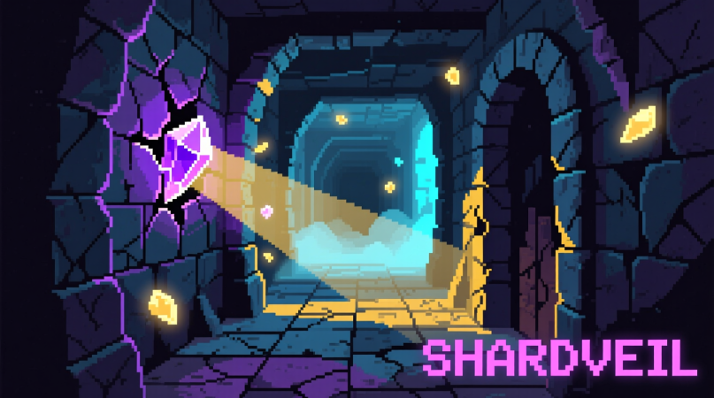

# Shardveil


## О проекте
Учебный проект на **Python** с использованием библиотеки **Arcade**: тёмный roguelike в сеттинге упавшего под землю мира.  
История о бывшем рыцаре, ищущем свет среди древних катакомб и шепчущих руин.

Проект находится на **раннем этапе разработки (MVP)**.  
Реализованы базовые механики:

- Игрок (Player) и первый враг (Skeleton)  
- Пошаговое движение по тайловой карте 32x32 пикселя  
- Контактный бой  

> Этот проект создаётся для **учебных целей**, как первый опыт разработки roguelike на Python и Arcade.

## Документация
Полное описание игры можно найти в [дизайн документе игры (GDD)](docs/GDD.md).

## Структура проекта
```
shardveil/
├── src/ 
│   ├── main.py         # основной игровой цикл
│   └── sv/             # папка с игровыми модулями
│       ├── core/       # настройки проекта, константы
│       └── entities/   # классы сущностей
├── assets/             # папка с графическими ресурсами
└── docs/               # документация проекта
```

## Установка и запуск
Склонируйте репозиторий и установите зависимости через pip:
```
git clone https://github.com/skulhex/shardveil
cd shardveil
pip install -r requirements.txt
```

Запуск игры:
```
python src/main.py
```

## План развития
- Процедурная генерация уровней
- Улучшение ИИ врагов
- Расширение механики света
- Система боя и инвентаря
- Новые типы врагов и предметы
- Звуковое оформление и музыка
- Минимальный сюжет
